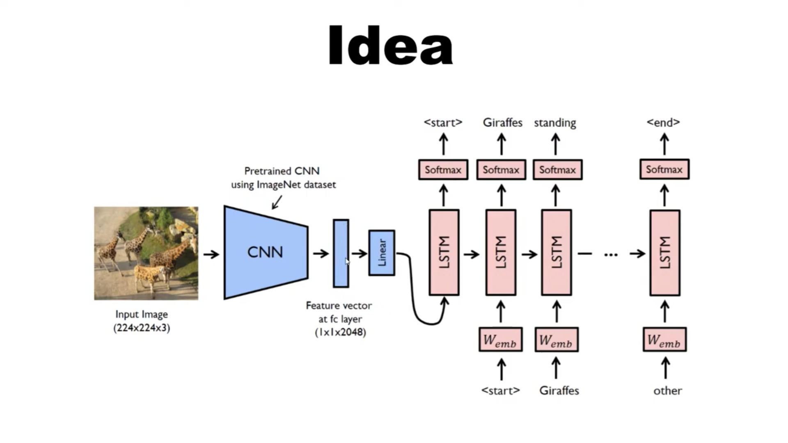

# Image-Captioning

Implement a image captioning from scratch with PyTorch

## Main Idea

Download the dataset used: [from here](https://www.kaggle.com/dataset/e1cd22253a9b23b073794872bf565648ddbe4f17e7fa9e74766ad3707141adeb)
Then set images folder, captions.txt inside a folder Flickr8k.
